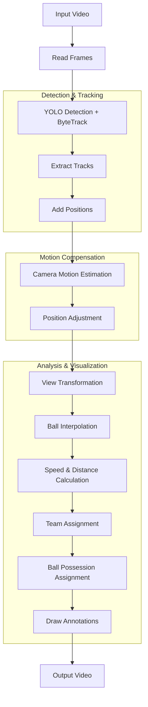

# Football Analysis Execution Pipeline

This document describes the end-to-end execution flow of the football analysis system, from video input to annotated output video with player tracking, ball possession, and performance metrics.

## Overview

The system processes football video footage to detect and track players, referees, and the ball, then analyzes their movements, team assignments, and ball possession patterns. The pipeline compensates for camera movements and transforms coordinates to provide metric-based analysis.

## Execution Flow



## Pipeline Stages

### 1. Video Input and Frame Extraction
- **Function**: `utils.video_utils.read_video()`
- **Input**: Video file path (e.g., `input_videos/08fd33_4.mp4`)
- **Output**: List of frames as numpy arrays
- **Process**: Uses OpenCV to read all frames into memory

### 2. Object Detection and Tracking
- **Function**: `Tracker.get_object_tracks()`
- **Input**: List of video frames
- **Output**: `tracks` dictionary with detected objects per frame
- **Process**: 
  - Runs YOLO model (`models/best.pt`) on frames in batches of 20
  - Maps goalkeeper class to player class
  - Uses Supervision's ByteTrack for multi-object tracking
  - Returns tracks for players, referees, and ball

### 3. Position Extraction
- **Function**: `Tracker.add_position_to_tracks()`
- **Input**: `tracks` dictionary
- **Output**: Updated `tracks` with position data
- **Process**:
  - Players: foot position (bottom center of bounding box)
  - Ball: center of bounding box
  - Referees: foot position

### 4. Camera Motion Estimation
- **Function**: `CameraMovementEstimator.get_camera_movement()`
- **Input**: List of video frames
- **Output**: List of [x, y] camera movements per frame
- **Process**:
  - Detects good features in first frame (corners, edges)
  - Uses Lucas-Kanade optical flow to track features between frames
  - Calculates maximum displacement as camera movement
  - Masks features to avoid field center (focuses on sidelines)

### 5. Position Adjustment
- **Function**: `CameraMovementEstimator.add_adjust_positions_to_tracks()`
- **Input**: `tracks` dictionary, camera movements per frame
- **Output**: Updated `tracks` with `position_adjusted` field
- **Process**: Subtracts camera movement from object positions to get field-relative coordinates

### 6. View Transformation
- **Function**: `ViewTransformer.add_transformed_position_to_tracks()`
- **Input**: `tracks` with adjusted positions
- **Output**: Updated `tracks` with `position_transformed` field
- **Process**:
  - Maps image coordinates to real-world field coordinates (meters)
  - Uses hardcoded homography transformation
  - Field dimensions: 68m × 23.32m
  - Only transforms points inside the field polygon

### 7. Ball Position Interpolation
- **Function**: `Tracker.interpolate_ball_positions()`
- **Input**: Ball tracks
- **Output**: Interpolated ball positions
- **Process**: Uses pandas interpolation to fill missing ball detections

### 8. Speed and Distance Calculation
- **Function**: `SpeedAndDistance_Estimator.add_speed_and_distance_to_tracks()`
- **Input**: `tracks` with transformed positions
- **Output**: Updated `tracks` with speed (km/h) and distance (m) fields
- **Process**:
  - Calculates speed over 5-frame windows
  - Converts to km/h (×3.6)
  - Accumulates total distance per player

### 9. Team Assignment
- **Function**: `TeamAssigner.assign_team_color()`
- **Input**: First frame, first frame player detections
- **Output**: Team color clustering model
- **Process**:
  - Extracts top half of player bounding boxes
  - Uses K-means clustering (2 clusters) on RGB values
  - Determines team colors from cluster centers

### 10. Ball Possession Assignment
- **Function**: `PlayerBallAssigner.assign_ball_to_player()`
- **Input**: Player tracks for current frame, ball bounding box
- **Output**: Player ID with ball possession
- **Process**:
  - Calculates distance from ball center to each player's left/right foot
  - Selects nearest player within threshold (70 pixels)
  - Returns -1 if no player is close enough

### 11. Video Annotation and Output
- **Function**: `Tracker.draw_annotations()`
- **Input**: Video frames, tracks, team ball control
- **Output**: Annotated video frames
- **Process**:
  - Draws player ellipses with team colors
  - Shows ball possession with blue triangles
  - Displays speed and distance metrics
  - Overlays team ball control percentages

## Data Structures

### Tracks Dictionary Schema

The `tracks` dictionary contains three main object types, each indexed by frame number:

```python
tracks = {
    "players": [  # List of frames
        {  # Frame 0
            player_id: {  # Integer track ID
                "bbox": [x1, y1, x2, y2],  # Bounding box
                "position": (x, y),  # Foot position (pixels)
                "position_adjusted": (x, y),  # Camera-compensated position
                "position_transformed": (x, y),  # Field coordinates (meters)
                "team": 1 or 2,  # Team assignment
                "team_color": (B, G, R),  # BGR color tuple
                "has_ball": True/False,  # Ball possession
                "speed": float,  # Speed in km/h
                "distance": float  # Total distance in meters
            }
        },
        # ... more frames
    ],
    "referees": [  # List of frames
        {  # Frame 0
            referee_id: {
                "bbox": [x1, y1, x2, y2],
                "position": (x, y),
                "position_adjusted": (x, y),
                "position_transformed": (x, y)
            }
        },
        # ... more frames
    ],
    "ball": [  # List of frames
        {  # Frame 0
            1: {  # Ball always has ID 1
                "bbox": [x1, y1, x2, y2],
                "position": (x, y),
                "position_adjusted": (x, y),
                "position_transformed": (x, y)
            }
        },
        # ... more frames
    ]
}
```

### Key Data Fields

- **bbox**: [x1, y1, x2, y2] - Bounding box coordinates in pixels
- **position**: (x, y) - Object position in pixels
- **position_adjusted**: (x, y) - Position after camera motion compensation
- **position_transformed**: (x, y) - Position in field coordinates (meters)
- **team**: 1 or 2 - Team assignment (1 = team 1, 2 = team 2)
- **team_color**: (B, G, R) - BGR color tuple for visualization
- **has_ball**: Boolean - Whether player possesses the ball
- **speed**: float - Current speed in km/h
- **distance**: float - Total distance covered in meters

## Module Responsibilities

### Main Pipeline (`main.py`)
- Orchestrates the entire pipeline
- Manages data flow between modules
- Handles stub loading/saving for development
- Produces final output video

### Tracker (`trackers/tracker.py`)
- YOLO-based object detection
- ByteTrack multi-object tracking
- Position extraction and ball interpolation
- Video annotation and drawing

### Camera Movement Estimator (`camera_movement_estimator/`)
- Lucas-Kanade optical flow for camera motion
- Feature detection and tracking
- Position adjustment for camera compensation

### View Transformer (`view_transformer/`)
- Homography-based coordinate transformation
- Field mapping and validation
- Metric coordinate conversion

### Team Assigner (`team_assigner/`)
- Player color clustering
- Team assignment persistence
- Color-based team identification

### Player-Ball Assigner (`player_ball_assigner/`)
- Distance-based ball possession assignment
- Player-ball proximity calculation
- Possession threshold management

### Speed and Distance Estimator (`speed_and_distance_estimator/`)
- Velocity calculation over time windows
- Distance accumulation
- Metric conversion and display

### Utilities (`utils/`)
- Bounding box operations
- Distance calculations
- Video I/O operations

## Configuration and Parameters

### Key Parameters
- **Ball assignment threshold**: 70 pixels (`max_player_ball_distance`)
- **Speed calculation window**: 5 frames
- **Camera motion threshold**: 5 pixels minimum displacement
- **Feature detection**: 100 corners, quality 0.3, min distance 3
- **Field dimensions**: 68m × 23.32m
- **Frame rate**: 24 FPS (assumed)

### Stub Files
- `stubs/track_stubs.pkl`: Pre-computed object tracks
- `stubs/camera_movement_stub.pkl`: Pre-computed camera movements

## Performance Characteristics

- **Detection**: ~20 frames per batch for YOLO inference
- **Tracking**: ByteTrack maintains IDs across frames
- **Camera motion**: Lucas-Kanade on ~100 features per frame
- **Memory usage**: All frames loaded into memory
- **Processing time**: Depends on video length and hardware

## Next Steps

For detailed information on improving ball tracking and camera motion compensation, see [Ball Tracking and Camera Compensation](ball-tracking-and-camera-compensation.md).

For scaling to full matches, see the scalability section in the same document.
